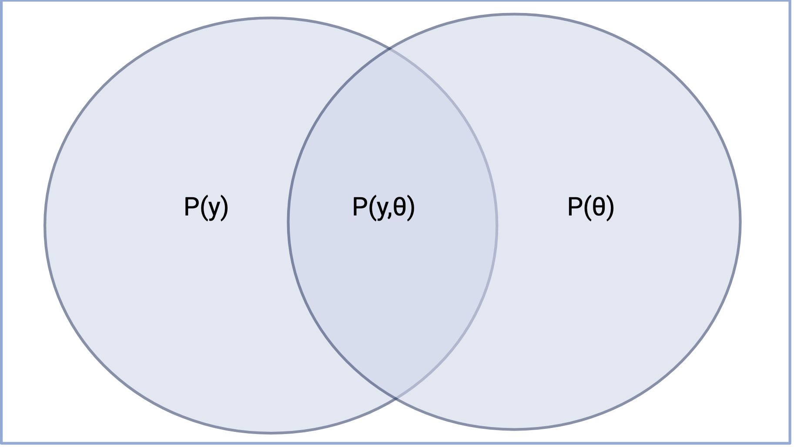
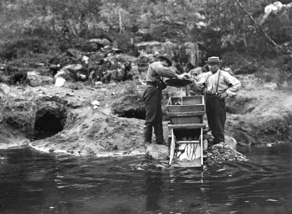

# Bayesian Inference

The aim of today's morning session is to understand Bayesian inference from a theoretical point of view, and to introduce a data analysis problem that motivates the course.

## Bayesian statistical inference

Bayesian statistical inference can be understood pretty well by looking separately at the two concepts "Bayesian" and "statistical inference".

### "Bayesian"

The word "Bayesian" comes from the statistician [Thomas Bayes](https://en.wikipedia.org/wiki/Thomas_Bayes), who proved some theorems about conditional probability functions in the 18th century. In modern usage, the term "Bayesian" doesn't really have much to do with the original Bayes; rather it means something like "to do with probability functions", with the exact meaning varying depending on the specific context.

Mathematically, a probability function is a function  $p: \mathcal{S} \rightarrow \mathbb{R}_{\geq 0}$ where:

- $\mathcal{S}$ is an [event space](https://en.wikipedia.org/wiki/Event_(probability_theory)#Events_in_probability_spaces) containing subsets of an arbitrary set $\Omega$ (formally, a $\sigma$ algebra).
- $p(\Omega) = 1$
- If $A, B \in \mathcal{S}$ are disjoint (i.e. they have no members in common), then $p(A\cup B) = p(A) + p(B)$

A "random variable" is a function from the set $\Omega$ to another set, often the real numbers. Especially when considering continuous sample spaces, it is often convenient to express events in terms of random variables rather than by defining the subset, for example, suppose we have $\Omega=[-1, 1]$ and random variable $A:\Omega\rightarrow\mathbb{R}$, where $A(x)=|10x|, x\in\Omega$. Then the expression $p(A>5)$ refers to the probability of the subset $\{x:A(x)>5\}$, i.e. the subset containing numbers between 0.5 and 1, and between -0.5 and -1.

Intuitively, probability functions describe more or less anything that can be measured. For example, a jug containing 1 unit of water

::: {#fig-jug}

A jug of water
:::

To draw out the analogy a little and connect the mathematical definition with the intuition, consider:

- In this case the set $\Omega$ corresponds to all the water inside the jug, modelled as a continuous set of points.
- $\mathcal{S}$ then represents any possible way of arranging all of the water. dividing the water in the jug into subsets. For example, pouring some of it out of the jug and into two cups.
- For any $X\in\mathcal{S}$, $p(X)$ is just the amount of water that $X$ contains, relative to the total amount $p(\Omega) = 1$. For example, perhaps cup $A$ contains $p(A)=0.4$ units of water and similarly for the other cup, $p(B) = 0.2$.
- Note that, as long as the cups do not contain the same water (i.e. they do not belong to a topologist and are not bath toys for a baby), subsets $A$ and
$B$ are disjoint, so that the total amount of water poured out is $p(A\cup B) = p(A) + p(B) =  0.6$

#### Bayesian epistemology

Bayesian epistemology is the idea that probability functions can describe belief or information. In other words, sometimes it is convenient to think about information as a thing that can be measured and shared around, like water. For example, we might use the cups $A$ and $B$ to represent some mutually exclusive propositions. Then we could represent the information "definitely B" by dividing the belief up like this:

We could also use this method to represent some other beliefs:

"Not sure if A or B":

{width=35%}

"B a bit more plausible than A":

{width=35%}

Interesting philosophical discussions can be had about whether this kind of analogy can describe *any* information. My personal favourite is the book "Patterns of Plausible Inference" [@polyaMathematicsPlausibleReasoning1990]. However, for Bayesian statistics to be useful we only need the weaker proposition that the analogy sort of works sometimes. I think this is pretty hard to dispute, as shown by how often people say things like "probably" or "100%" to describe information.

### Statistical inference

The problem of finding things out about a population by examining a sample from the population encompasses statistical inference. This is something we all do all the time, which shows that you really know how to do statistical inference already: doing this course may not teach you something new so much as make your existing knowledge easier to articulate! An example of sample to population inference that you may have experience with is tasting a spoonful from a pot of soup:

::: {#fig-soup}

A nice soup: [here is the recipe](https://www.theguardian.com/lifeandstyle/2017/jan/24/20-best-one-pot-recipes-part-2-tom-kerridge-nigella-lawson-broths-hangover-food)
:::

Typically, salt mixes pretty well into the soup, so it is pretty safe to say that the salt concentration of the whole pot of soup will be about the same as the concentration in the spoon. On the other hand, if your goal was to establish the total number of carrots in the pot per unit volume, counting the number in a spoonful might not be so reliable!

The aim of theoretical statistical inference is to construct systematic rules for sample-to-population reasoning of this type. For example, we might use the following rule:

> It is safe to say that the concentration of a thing in the spoon is about the same as the concentration in the pot, provided there are at least 1000 particles of the thing in the spoon.

::: {.callout-tip}
#### Exercise
Can you think of any problems with this rule?
:::

### What is Bayesian statistical inference?

Equipped with the concepts "Bayesian" and "statistical inference", we can now make a definition of "Bayesian statistical inference":

Bayesian inference is sample-to-population inference that results in statements about a probability function, i.e. an assignment of numbers to elements of an event space.

For example, faced with the tasting problem, these statistical inferences are "Bayesian"

- spoon $\rightarrow$ $p(\text{soup not salty})$ = 99.9%
- spoon $\rightarrow$ $p(\text{no carrots in soup})$ = 95.1% 

To illustrate that other forms of statistical inference are possible, consider these non-Bayesian inferences:

- spoon $\rightarrow$ Best estimate of salt concentration is 0.1mol/l
- $p_{\text{carrot hypothesis}}(\text{spoon with fewer carrots than this}) = 4.9\%$ $\rightarrow$ There are no carrots in the pot!

The first inference is non-Bayesian because the result---a best estimate of the population salt concentration---is not a probability.

::: {.callout-tip}
#### Something to think about
How might we *get* an estimate of the population concentration from a Bayesian inference, if that was what we wanted?
:::

The second inference has the same form as a null-hypothesis significance test, a statistical inference method you may be familiar with. The inference kind of looks probability-like, so you might wonder if it is Bayesian according to our definition. The answer is no! There *is* a probability statement on the left hand side of the inference, i.e. the statement that, according to a probability function representing the hypothesis that there are carrots in the pot, it would be unlikely to see this few carrots. However, according to our definition Bayesian inference requires a probability statement on the right hand side. 

## Why probability?

Since the special thing about Bayesian inference, compared with other ways of doing statistical inference is that it outputs a statement about a probability function, the reasons for choosing Bayesian inference also have to do with the features of probabilities.

### Probabilities are interpretable

It is straightforward to interpret statements about probabilities in terms of information and plausible reasoning. For example, after doing a Bayesian inference, one can say things like "According to my model, proposition x..."

- "...is highly plausible."
- "...is more plausible than y."
- "...is neither ruled in or out by the available data. There just isn't enough information for firm conclusions about x."

In contrast, non-Bayesian statistical inferences can be trickier to interpret.

For a lot more about this and other connections between Bayesian inference, information and plausible reasoning, check out [@jaynesProbabilityTheoryLogic2003].

### Probability theory is old

Probability theory is a mature and well-developed branch of mathematics. This makes probability functions a good choice for the output of a statistical inference for several reasons. First, since so much work has already been done, it is rare that Bayesian inference is blocked by the need to develop new mathematical theory. In fact, the theoretical apparatus of Bayesian inference was already available to Pierre-Simon Laplace: the Bayesian inference that he practised before the French revolution is essentially the same as you will learn in this course.

::: {#fig-laplace width="40%"}

{height=80%}

Laplace, who did Bayesian inference in the 1780s
:::

Second, the maturity of probability theory means that Bayesian statistical inference is compatible with a wide range of related tools, and in particular Bayesian decision theory. Whereas users of newer statistical frameworks must do some original work to justify what they want to do with their inferences, Bayesian inference practitioners can simply specify a utility function and then plug in to the existing theory.

#### Conditional probabilities

The derivation of Bayes' theorem requires us to derive different conditional probabilities so we can rephrase the problem into one that is computationally feasible and epistemologically correct.

::: {#fig-venn_diagram width="40%"}

A figure to help derive Bayes' theorem
:::

Probability statements have a precise meaning. Given this venn diagram we can say that the probability of $y$ given $\theta$, or in different terminology $p(y\mid \theta)$, is given by the joint distribution $p(y, \theta)$ divided by the probability of $\theta$ or $\frac{p(y, \theta)}{p(\theta)} = p(y\mid \theta)$.

::: {.callout-tip}
#### Exercise
How would you derive the probability of $\theta$ given $y$?
:::

### Probabilities decompose conveniently, aka Bayes's theorem

Probabilities decompose nicely according to Bayes' theorem:

$$
p(\theta, d) = p(\theta)p(d\mid\theta)
$$

This expression is nice because the components have natural interpretations:

- $p(\theta)$, aka "prior distribution": nice form for *background* information, e.g. anything non-experimental
- $p(d\mid\theta)$, aka "sampling distribution", "data distribution", "likelihood function": a nice form for describing the data-generating process
- $p(\theta, d)$, aka "joint probability distribution" a single function that encapsulates the whole model

::: {.note}
Bayes's theorem is typically presented in these equivalent forms:

$$
p(\theta\mid d) = \frac{p(\theta)p(d\mid\theta)}{p(d)}
$$

or 

$$
p(\theta\mid d) \propto p(\theta)p(d\mid\theta)
$$
:::

## Reasons *not* to use Bayesian inference

Bayesian inference is not the best choice for every data analysis problem: there are a number of solid practical reasons *not* to use Bayesian inference that you should be aware of.

### Computational reasons

The biggest reason not to use Bayesian inference is its often-high computational cost. The section on MCMC will touch on the specifics of this, but here is the short version. Suppose we are interested in some unknown quantity, perhaps the concentration of salt molecules in the bowl of soup. We typically want to know something like "Is the amount of salt correct", i.e. is $\|\text{salt}\|$ greater than some number $l$ and less than some other number $h$. The way to answer this question using Bayesian inference is to first taste a spoonful, then, probably using Bayes's theorem, write down a probability density function that assigns a number to any possible value of $\|\text{salt}\|$. To answer our question, we have to integrate our function $p$ between $l$ and $h$:

$$
\text{Probability that the saltiness is correct} = \int_{l}^{h}p(spoon\mid\|\text{salt}|)d|\text{salt}|
$$

This is the problem: integration is difficult! Many probability functions accurately describe experimental setups, but are impossible to differentiate analytically. In such cases doing Bayesian inference requires expensively solving the integration problem numerically, using methods like Monte Carlo integration. This case is typical, so in practice Bayesian inference requires expensive computation.

The practical upshot of this problem is that you may not have the computational resources or time to solve your data analysis problem using Bayesian inference. If so, you might be better off using non-Bayesian statistical inference, which may actually produce an answer. Here are some rules of thumb for predicting whether you are in such a situation, assuming you are not a billionaire and want to use general-purpose methods:

- More than ten million unknown parameters that need to be estimated at the same time
- More than one hundred million data points must be taken into account
- More than one hundred unknown discrete parameters need to be estimated (this includes qualitatively different models being jointly compared or mixture distribution components)

### Do I need statistical inference at all?

::: {#fig-prospecting}

[Prospectors](https://en.wikipedia.org/wiki/Gold_prospecting#/media/File:Kullanhuuhdontaa_Ivalossa.jpg). Are you doing inference or prospecting? Sometimes the goal is not to perfectly survey the landscape, but to find gold quickly.

:::

As we found out above, statistical inference aims to answer questions about a population based on a sample. That isn't the only thing you can do with samples! Often we aren't primarily interested in knowing facts about the population, but rather want to use the information in the sample to get something: maybe a more optimal set of numbers, maybe any set of numbers that satisfies some qualitative condition.

I like to call this kind of use for data ["prospecting"](https://en.wikipedia.org/wiki/Prospecting), in the sense of exploring an area looking for mineral deposits. In a gold rush, prospectors typically want to quickly and cheaply discover and extract any gold in a sample area, then choose a good area to prospect next. Another appropriate term might be "optimisation", but I think that one under-emphasises the quite common case where the goal is to satisfy some conditions rather than get the best possible score on a metric.

The line between inference and prospecting is blurry, as inference is rarely done entirely for its own sake: usually the ultimate goal is to do something useful with the inferences. Conversely, it is rare for prospecting not to answer any questions about the un-sampled population: this would only happen with a totally random search. However, I still think the distinction is helpful because it can help answer the question whether or not to use Bayesian inference.

If your data-analysis problem feels more like prospecting, you *may* want to use Bayesian inference. For example, Bayesian optimisation, which we will explore later, is a well-tested and widely-adopted prospecting method based on Bayesian inference. On the other hand, it may be faster or cheaper to use a non-Bayesian method.

### Explaining Bayesian inference

The statistics wars of the 1980s and 1990s are long since finished and mostly forgotten, but Bayesian inference is still unfamiliar to many people and communities. As a result, it is often easier to use non-Bayesian inference, thereby avoiding the effort of explaining and justifying a new statistics thing.If Bayesian and non-Bayesian inference would both produce the same result in any case, this benefit my outweigh any benefits from using Bayesian inference. If all of these conditions are satisfied, you may be in such a situation:

- Information other than the measurements has little relevance.
- The measurements are structurally simple: for example there aren't any groups of measurements that systematically differ from other groups.
- Any decisions that need to be made based on the inference are qualitative, yes-or-no type decisions. 
- The experiment is likely to be conclusive one way or the other.

This is quite a high bar because, as this course will show, it's really not that hard to explain Bayesian inference!

## Motivating example

As biologist we are often posed questions that require statistical analysis:
- Does cell line A produce more than cell line B?
- Are the growth rates of these the same or different?
- How does composition correlate to some phenotype?
Despite sounding like a simple analysis achieved using standard
linear regression techniques the noise associated with biological systems,
measurements of such systems, and often limited observations result in
poor statistical inference. This course will present narrative modelling
as an approach to improve inference. As its name implies narrative modelling
describes the story or model about how the observations were generated.

Let us examine a simple case: estimating the protein concentration in a cell
and comparing them between cell lines. For this model there are two points of
interest: Firstly, there's the biological variation from experiment to experiment;
and secondly, there is the measurement model that quantifies the protein. We can
represent the model as follows

$$
\begin{align*}
\mu_{reactor} &\sim LogNormal(\mu_{true, reactor}, \sigma_{quant}) \\
\mu_{true, reactor} &\sim LogNormal(\mu_{true, strain}, \sigma_{biological})
\end{align*}
$$

We have done this experiment many times before and we have a reasonable idea
about how accurate our quantification process is, and the variation we can
expect between our reactors.

$$
\begin{align*}
\sigma_{quant} &\sim logNormal(log(0.01), 0.1) \\
\sigma_{biological} &\sim HalfNormal(0.03)
\end{align*}
$$

By doing so we are explicit about how and what we are choosing to
do with our model. Comparisons towards frequentist approaches are
going to be limited throughout this course as this is not our objective,
however, we will do so for this example.

## Things to read

@boxBayesianInferenceStatistical1992 [Ch. 1.1] (available from dtu findit) gives a nice explanation of statistical inference in general and why Bayes.

@gelmanBayesianDataAnalysis2020 is a great textbook. The first chapter in particular gives a very nice presentation of the relevant mathematics.

Historical interest:

- @laplaceMemoirProbabilityCauses1986 and @stiglerLaplace1774Memoir1986 
- @jaynesProbabilityTheoryLogic2003 Preface
