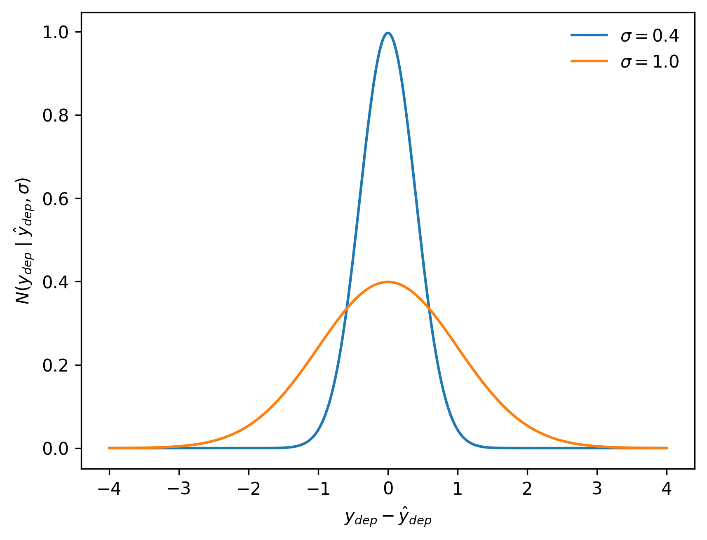

# Day 2 am: Regression and formula-based models

## Regression

Recall from the previous session that one of the advantages of Bayesian statistical inference---aka using a sample to answer questions about a population in the form of probability statements---is that probability functions decompose into the following convenient form:

$$
p(d, \theta) \propto p(\theta)p(d\mid\theta)
$$

In particular, we mentioned that the form $p(d\mid\theta)$ is convenient for representing data generating processes.

Regression is the main way to flesh out this idea: it provides specific ways to say, for data $d$ and parameters $\theta$, what is the likelihood $p(d\mid\theta)$.

The key idea of regression is to model the situation where the data $d$ naturally come in pairs, so that $d_i = (x_i, y_i)$. The first variables $x$ are called "covariates", or "independent" variables, and the variables $y$ are typically called "variates" or "dependent variables". The variates represent things that are measured in an experiment and the covariates things that can predict the measurements.

With this split made, the next step in regression modelling is to define a way to turn the covariates into a summary statistic, then connect this statistic probabilistically with $y$. In mathematical notation, this means that a regression model has this form:

$$
p(d\mid\theta) = p(y\mid T(x, \theta), \theta)
$$

where $T$ is a deterministic function that maps any $x$ and $\theta$ to a summary statistic.

A popular approach, which we will concentrate on in this course, is for the summary statistic $T(x, \theta)=\hat{y}(x, \theta)$ to be an estimate of the most likely, or "expected", value of $y$. Alternatively, in [quantile regression](https://en.wikipedia.org/wiki/Quantile_regression) the summary statistic estimates an extreme value of $y$.

Formulating $p(d\mid\theta)$ up in this way allows a regression modeller to separately create a deterministic model of the underlying process and a probabilistic model of the measurement process. This separation is very convenient!

Being able to choose any deterministic function $T$ to represent the relationship between $x$, $\theta$ and $y$ allows the modeller a lot of freedom to represent domain knowledge. For example, $T$ might encode a kinetic model connecting experimental conditions with things we can measure in a bioreactor.

On the other hand, writing down a function $p(y\mid T(x, \theta), \theta)$ is often easier than directly specifying a likelihood function $p(d\mid\theta)$. The former, regression-based formulation is natural for representing how noisy measurements work. For example, regression models often represent measurements using the normal distribution:

$$
\begin{align*}
\theta &= \theta_1, ..., \theta_k, \sigma \\
T(x, \theta) &= T(x, \theta_1, ..., \theta_k) = \hat{y}\\
p(y\mid T(x, \theta), \theta) &= N(y\mid \hat{y}, \sigma)
\end{align*}
$$

In this equation $N$ indicates the normal probability density function:

$$
N(y\mid\hat{y},\sigma) = \frac{1}{\sqrt{2\pi\sigma^2}}\exp{-\frac{(y-\hat{y})^2}{2\sigma^2}}
$$

To get an intuition for why this makes sense as a way to represent a measurement, consider the following plot of this function:

Note that, as we usually expect for a measurement, the density is highest when the measured and expected values are the same, and smoothly and symmetrically decreases with this distance. The accuracy of the measurement can be captured by the parameter $\sigma$, as shown by comparing the blue and orange lines.

### Representing measurements using probability distributions

Here are some rules of thumb for representing measurements using probability distributions.

The most important thing is to consider are natural constraints: where does the measurement *have* to live?

#### Unconstrained measurements

If both measureable and measurement can in principle live on any the real line, the Normal regression model presented above is usually a good starting point. Many standard statistical methods explicitly or implicitly assume such a model.

If your unconstrained measurements come in batches, consider whether they are likely to be correlated, so that the value of one batch component could be informative about the value of another. If so, you may want to use a [multivariate normal distribution](https://en.wikipedia.org/wiki/Multivariate_normal_distribution) to model your measurements.

If, as happens quite often, your unconstrained measurements potentially include outliers, they may be better described using a measurement distribution with heavier tails than the normal distribution, such as the [student-T distribution](https://en.wikipedia.org/wiki/Student%27s_t-distribution).

If your unconstrained measurements are skewed, so that errors in one direction are more likely than the other, consider modelling them with a [skew-normal distribution](https://en.wikipedia.org/wiki/Skew_normal_distribution).

#### Non-negative measurements

We often want to measure things that cannot possibly be negative, like concentrations or temperatures. This kind of measurement is often **not** well described by the normal distribution.

First, note that the normal distribution has support across the whole real number line, half of which is inaccessible to a non-negative measurement. Modelling non-negative measurements using the normal distribution therefore necessarily involves allocating probability mass to something structurally impossible. How big of a problem this is in practice depends on the amount of probability mass misallocated: this in turn depends on the distance in measurement standard deviations from $\hat{y}$ to zero. As a general rule of thumb, if this distance is less than 3 standard deviations for any measurement, there is a potential problem. 

Second, note that the normal probability density function is symmetrical: the density decreases at the same rate both up and down from $y-\hat{y}=0$. This behaviour is desirable when an error gets less likely proportionally to its absolute size. However non-negative measurement errors are often naturally expressed relatively, not absolutely. If you usually talk about your errors in terms like "+/- 10%" or similar, an unconstrained probability distribution is probably a bad fit.

For these reasons, when modelling non-negative measurements, it is often a good idea to use a probability distribution whose support lies only on the non-negative real line. This can often easily be done by log-transforming the measurements and then using an unconstrained measurement distribution centred at the logarithm of $\hat{y}$.

#### Measurements that live in the interval [-1, 1]

Try transforming the measurements to unconstrained space using the inverse hyperbolic tangent function.

#### Counts

Use the poisson distribution.

#### Ranks

Try the rank-ordered logit distribution. Good luck!

#### Compositions

This is a whole area of statistics, but you can get a long way by transforming compositional measurements to unconstrained space using a [log-ratio function](https://en.wikipedia.org/wiki/Compositional_data#Linear_transformations).

### Representing domain knowledge using linear models

In a regression model the function $T(x, \theta)$ encodes the modeller's knowledge about how the measurement targets depend on the covariates and parameters. The simplest, and by far most common, way to do this is with a linear model.

A linear model assumes that the expected value of the measurable, i.e. $\hat{y}$, depends on a weighted sum of the covariates $x$. For example, we might have

$$
\hat{y} = x\beta
$$

Where $\beta$ is a vector of weights.

::: {.note}

Note that this formulation allows for an intercept, i.e. a weight that applies to all measurements, via inclusion of a dummy variable in $x$ whose value is 1 for all measurements.

:::

To accommodate constrained measurement models without changing the approach too much, linear models often add a "link" function that transforms the unconstrained term $x\beta$ to match the constrained term $\hat{y}$. Models with this form are called "generalised linear models" or "GLM"s. For example, here is a poisson GLM for describing count data, where the link function is the natural logarithm:

$$
\begin{align*}
\ln(\hat{y}) &= x\beta \\
y &\sim Poisson(\hat{y})
\end{align*}
$$

::: {.note}

Note the use of the operator $\sim$ here. It can be interpreted as saying that the variable on the left "has" the probability distribution on the right. In other words it is a shorthand for this kind of statement about a probability function:

$$
A \sim N(\mu, \sigma) \iff p(A=a\mid \mu, \sigma) = N(a\mid \mu, \sigma)
$$

:::

#### Don't forget to transform the covariates!

Linear models have a lot of hidden flexibility, as the modeller is free to transform the covariates any way they like. You can and should make the most of this freedom. In particular, consider log-transforming any positive-constrained covariates: this effectively creates a multiplicative rather than additive effect, which is often what you want.

#### Hierarchical models

Often there are systematic differences between different groups of data points. For example, measurements that are biological replicates are likely to be similar. Regression models can capture this kind of difference by adding more weight parameters: instead of one weight per covariate, we can use one weight per covariate, per group. Adding parameters in this way has the downside that there are fewer measurements per parameter, potentially dramatically increasing the number of experiments required to get reliable estimates.

Hierarchical regression models provide a clever solution to this dilemma, by adding even more parameters that flexibly regularise the other parameters. For example, suppose we have the following model for a measurement from replicate $r$:

$$
\begin{align*}
\ln(\hat{y}) &= \beta_{r} \\
y &\sim Poisson(\hat{y})
\end{align*}
$$

To regularise the $\beta$ parameters in this model, we can add the following hierarchical component:

$$
\beta \sim N(\mu_{\beta}, \tau_{\beta})
$$

Models with this structure are called "hierarchical" because they include "hyper-parameters" like $\mu_{\beta}$ and $\tau_{\beta}$ that control other parameters.

Note that in this model the hyper-parameter $\tau_{\beta}$ controls how likely it is, according for the model, for the bottom-level parameters $\beta$ to differ from $\mu_{\beta}$. The smaller $\tau_{\beta}$ is, the more model penalises these differences. In this way, the model is flexible, able to capture both strong and weak similarity between same-replicate measurements.

In a Bayesian hierarchical model, the prior model can provide further regularisation for both hyper-parameters and bottom-level parameters, allowing the modeller to 

## Formula-based models

Wilkinson notation, introduced in 1973 [@wilkinsonSymbolicDescriptionFactorial1973], provides a convenient and very succinct way of expressing linear models in just a few characters, using short formulae like `y ~ x1 + x2`.

The idea with a formula-based models is for the `~` symbol to separate the variates on the left from the covariates on the right, and for the right hand side to succinctly express how to get $\hat{y}$ from the covariates.

Wilkinson-style formulae can be surprisingly expressive. In particular, hierarchical models can be expressed by including categorical variables in the formula and using a `|` symbol. For example, in the Python library [formulae](https://bambinos.github.io/formulae/notebooks/getting_started.html#Group-specific-effects) the formula `y ~ x + (1|g)` expresses a hierarchical linear model where the expected value of `y` depends on a real-valued covariate `x` and a categorical variable `g`, with the dependency captured by an additive term `(1|g)`, sometimes called a "random intercept".

Libraries like [bambi](https://bambinos.github.io/bambi/) and its R counterpart [brms](https://paulbuerkner.com/brms/) provide ergonomic interfaces for specifying and fitting Bayesian statistical models with the help of Wilkinson-style formulae. In the next session we will try using bambi.

### When and when not to use formula-based models

Formula-based modelling is a great fit for a wide Bayesian data analyses, provided that the data comes in tabular format. They don't work so well when the data is hard to squeeze into a single table.

